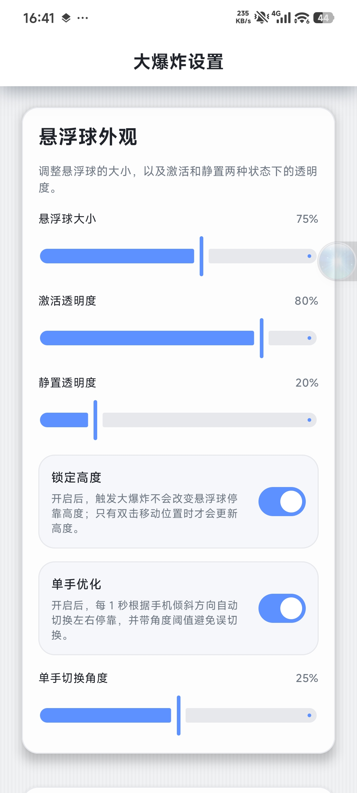
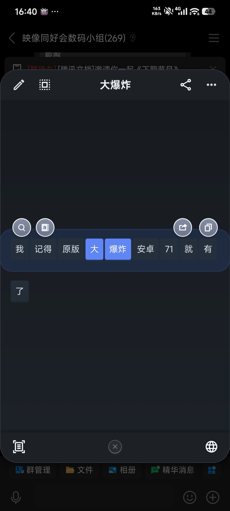
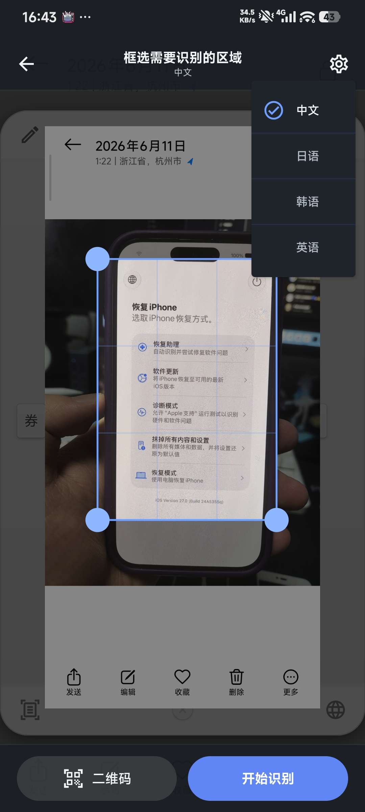

<p align="center">
  <a href="screenshots/1.jpg"></a>
  <a href="screenshots/2.jpg"></a>
  <a href="screenshots/3.jpg"></a>
  <a href="screenshots/4.jpg"></a>
  <a href="screenshots/5.jpg"></a>
</p>

# Nova Text

Nova Text 是经典 Smartisan OS「大爆炸」功能的 Android 原生迁移与现代化项目。

当前仓库不是概念验证阶段，已经具备完整的本地化主链路：

- 本地 `cppjieba` 分词
- Compose 设置页
- BigBang 浮层壳 + legacy 词块内核
- Compose 搜索浮层 + WebView
- 悬浮球 + 无障碍文本提取
- ML Kit OCR V2 离线识别
- OCR 白名单分流
- 统一的悬浮球启动 loop 动画和 BigBang 入场动画

## Android 版本支持策略

- Android 11+：当前主维护目标，优先保证完整功能适配与稳定性
- Android 7-10：当前仅作二级支持
  - 允许继续编译和尝试运行
  - 不保证所有功能可用
  - 不保证不同机型上的稳定性与一致性

## 当前进度

已完成：

- Gradle 构建已打通，继续兼容 legacy `src/` / `res/` 目录
- `cppjieba` JNI 已替代远程分词主路径，并在启动后后台预热
- 设置页已重构为 Compose，支持深色模式、调试入口、悬浮球配置、OCR 白名单配置
- 设置页已补悬浮球锁定高度、单手优化、单手角度阈值、识别调试日志和 Android 7-10 Shizuku 状态
- BigBang 页面已接入 Compose 外层浮层壳，内部词块选择与多选逻辑仍复用 legacy Java
- 搜索页已改为 Compose + WebView 浮层页
- OCR 已切到离线 ML Kit V2，支持中文 / 日语 / 韩语 / 英语
- 设置页图片调试入口与系统图片分享入口可进入 OCR 范围选择页
- 悬浮球白名单 OCR 链路已接通：截图后直接全屏 OCR，并按触点命中最近文本块进入 BigBang
- 悬浮球无障碍链路已补静默截图缓存，供 BigBang 内手动重进 OCR 复用
- “炸了又炸”已接通，支持上下拖拽拉取相邻段落，并对连续短段落做批量追加
- BigBang 外壳已支持重新 OCR 识别，以及 OCR 结果的临时语言切换重跑
- 搜索页已扩展 DuckDuckGo、萌娘百科，浏览器操作栏已补前进和刷新

仍在进行：

- 编辑模式仍是 placeholder，尚未接回可用交互
- 横屏与平板适配尚未系统收口
- 多机型、多 Android 版本下的实机兼容性验证和 Debug 仍需持续推进
- OCR 最近段落命中、段落合并和复杂页面提取规则仍会继续打磨，但不再是“链路未打通”状态

## 快速使用

### 设置页

启动 `TextBoomSettingsActivity` 后可直接：

- 检查悬浮窗 / 无障碍状态
- 启动和停止悬浮球
- 调整悬浮球大小与透明度
- 调整悬浮球锁定高度、单手优化与角度阈值
- 切换预制调试文本并预览 BigBang
- 配置搜索源、词典源、OCR 语言和 OCR 白名单
- 开启识别调试日志
- 选择图片进入 OCR 调试

### 悬浮球主链路

1. 授予悬浮窗权限
2. 启用 `NovaTextAccessibilityService`
3. 在设置页启动悬浮球
4. 将悬浮球拖到目标区域后松手

当前分两条路径：

- 白名单外：先隐藏悬浮球并静默截图缓存，再显示 loop 动画，随后走无障碍文本提取；若无障碍抓不到文本，再复用同一张缓存图回退到 OCR
- 白名单内：先隐藏悬浮球并截图，再显示 loop 动画，随后走全屏 OCR，并按触点命中最近文本块进入 BigBang
- 悬浮球主链路的截图缓存只保存在内存里，且只保留当前活动 token，对应旧图会自动回收
- 前台应用识别优先取无障碍活跃窗口，其次回退到无障碍最近事件缓存；两者都拿不到时直接走 OCR
- Android 11+ 优先用无障碍截图；Android 7-10 走 Shizuku 截图回退
- 悬浮球拖动松手后会自动贴到屏幕左侧或右侧，横屏下也不会停在屏幕中间
- 悬浮球启动完成后由 `notifyBigBangShellShown()` 收口 loop 动画和隐藏状态；3 秒内未拉起外层 UI 会自动兜底恢复悬浮球
- 进入 BigBang 后可继续上滑 / 下滑触发“炸了又炸”，并可从底栏重进 OCR 或临时切换 OCR 语言

### OCR 调试 / 分享链路

这两条入口保留手动范围选择页：

1. 图片输入
2. 范围选择
3. 离线 OCR
4. BigBang

说明：

- OCR 结果进入 BigBang 后，左下角可重进 OCR 范围选择
- OCR 来源的 BigBang 右下角可临时切换识别语言，并立即重跑 OCR
- 这类临时切换不会修改设置页里的默认 OCR 语言
- 图片输入、分享和悬浮球缓存图复用的 OCR 源都统一走 `ManualOcrSourceStore`，不再落盘缓存

## 第三方应用调用

### 调用方式总览

| 方式 | 是否弹选择器 | 推荐度 | 说明 |
|---|---|---|---|
| 自定义 Action | 否 | 推荐 | 直接打开 BigBang，不依赖类名 |
| 显式 Intent（setClassName） | 否 | 可用 | 最直接，但耦合具体类名 |
| ACTION_SEND | 是 | 通用分享 | 走系统分享选择器，用户自选 |

### 自定义 Action 调用（推荐）

BigBang 注册了自定义 Action `com.cashewteam.novatext.android.action.BIGBANG_TEXT`，第三方应用可通过隐式 Intent + `setPackage()` 直接打开 BigBang，无需弹选择器：

```kotlin
val intent = Intent("com.cashewteam.novatext.android.action.BIGBANG_TEXT").apply {
    setPackage("com.cashewteam.novatext.android")
    putExtra(Intent.EXTRA_TEXT, "要分解的文本内容")
    // 可选：动画锚点
    putExtra("boom_startx", 540)
    putExtra("boom_starty", 1200)
    // 可选：自动选中第 3 个字符所在的分词
    putExtra("extra_selected_char_index", 2)
    // 可选：炸了又炸 — 前一段落
    putExtra("extra_adjacent_text_before", "前一段落内容...")
    // 可选：炸了又炸 — 后一段落
    putExtra("extra_adjacent_text_after", "后一段落内容...")
}
// 先检查是否安装了 BigBang
if (intent.resolveActivity(packageManager) != null) {
    startActivity(intent)
}
```

#### 检查 BigBang 是否可用

```kotlin
fun isBigBangAvailable(context: Context): Boolean {
    val intent = Intent("com.cashewteam.novatext.android.action.BIGBANG_TEXT")
    intent.setPackage("com.cashewteam.novatext.android")
    return intent.resolveActivity(context.packageManager) != null
}
```

### 显式 Intent 调用

直接指定包名和类名，最直接但耦合度高（类名可能变化）：

```kotlin
val intent = Intent().apply {
    setClassName(
        "com.cashewteam.novatext.android",
        "com.cashewteam.novatext.android.BoomActivity"
    )
    putExtra(Intent.EXTRA_TEXT, "要分解的文本内容")
    putExtra("boom_startx", 540)
    putExtra("boom_starty", 1200)
    putExtra("extra_adjacent_text_before", "前一段落...")
    putExtra("extra_adjacent_text_after", "后一段落...")
}
startActivity(intent)
```

### 标准分享 Intent

通过 `ACTION_SEND` 走系统分享选择器，用户自行选择 BigBang：

```kotlin
val intent = Intent(Intent.ACTION_SEND).apply {
    type = "text/plain"
    putExtra(Intent.EXTRA_TEXT, "要分解的文本内容")
    putExtra("boom_startx", 540)
    putExtra("boom_starty", 1200)
    putExtra("extra_adjacent_text_before", "前一段落...")
    putExtra("extra_adjacent_text_after", "后一段落...")
}
startActivity(Intent.createChooser(intent, "分享到 BigBang"))
```

### Extra 键值说明

| Extra Key | 类型 | 必填 | 说明 |
|---|---|---|---|
| `Intent.EXTRA_TEXT` | String | 是 | 要分解的主文本 |
| `extra_selected_char_index` | int | 否 | 用户选中的字符在主文本中的索引（0-based），传入后自动选中该字符所在的分词 |
| `extra_adjacent_text_before` | String | 否 | 前一段落文本，支持多行（`\n` 分隔），每行一次"炸了又炸"上滑加载 |
| `extra_adjacent_text_after` | String | 否 | 后一段落文本，支持多行（`\n` 分隔），每行一次"炸了又炸"下滑加载 |
| `boom_startx` | int | 否 | BigBang 面板展开动画的 X 锚点 |
| `boom_starty` | int | 否 | BigBang 面板展开动画的 Y 锚点 |
| `extra_enable_adjacent_session` | boolean | 否 | 保留内部会话状态（内部使用，第三方无需设置） |

### 行为说明

- 当 `extra_adjacent_text_before` 或 `extra_adjacent_text_after` 至少有一个非空时，BigBang 自动启用"炸了又炸"功能
- 当 `extra_selected_char_index` ≥ 0 时，BigBang 在分词完成后自动选中该字符所在的分词，同时滚动到该分词所在行
- `extra_selected_char_index` 为 0-based 字符索引，基于 `Intent.EXTRA_TEXT` 的原始文本计算
- 相邻文本按 `\n` 换行符逐行拆分为独立段落，每次上滑/下滑加载一行（短行可能合并为一次加载，与内部无障碍抓取行为一致）
- 相邻文本通过 `TextSessionCoordinator.replaceSession()` 注入，source 标记为 `"external"`
- 用户在 BigBang 界面上滑/下滑时，BoomChipPage 的拖拽手势触发 `peekAdjacentText()` → `loadAdjacent()`，与内部无障碍抓取的"炸了又炸"行为一致
- 如果不传相邻文本 extras，"炸了又炸"功能不可用（与之前行为一致）

## 构建

```bash
bash ./gradlew assembleDebug
```

当前主要源码目录：

- `src/com/smartisanos/textboom/`：legacy Java BigBang 内核、词块布局、多选逻辑
- `app/src/main/kotlin/com/smartisanos/textboom/`：Compose 页面、Activity、Service、OCR、启动编排
- `app/src/main/kotlin/com/smartisanos/textboom/domain/capture/`：无障碍文本提取会话与最近段落窗口
- `app/src/main/cpp/`：`cppjieba` JNI
- `archive/legacy-ui/`：已归档的旧设置页 / 旧搜索页代码，不再主链路编译

## 文档

- [文档索引](./docs/README.md)
- [开发计划](./docs/development-plan.md)
- [架构文档](./docs/architecture.md)
- [接口与 API 文档](./docs/api.md)

## 致谢

- [cppjieba](https://github.com/yanyiwu/cppjieba)
- [BigBang](https://github.com/SmartisanTech/packages_apps_BigBang)


## License / 许可证说明

Nova Text 作为一个整体，以 **GNU General Public License v3.0（GPLv3）** 协议分发。完整协议文本见 [`LICENSE`](./LICENSE)。

本项目是基于 SmartisanTech 开源的 BigBang / BigBoom 应用继续开发的社区分支与现代化改造版本。原始项目基于 **Apache License 2.0** 发布，因此本仓库中来自原始 SmartisanTech BigBang / BigBoom 项目的代码、资源、版权声明与归属信息，仍然保留其原有的 Apache License 2.0 授权与声明。Apache License 2.0 协议文本见 [`LICENSE-Apache 2.0`](./LICENSE-Apache%202.0)。

本仓库的许可结构可以理解为：

* 本分支作为整体，包括 Nova Text 新增代码、重构代码、集成逻辑、现代化适配、构建系统调整和项目特定修改，按 **GPLv3** 分发。
* 来自原始 SmartisanTech BigBang / BigBoom 项目的部分，仍保留原始 **Apache License 2.0** 的版权声明、归属声明和许可要求。
* 基于原始项目修改过的文件，可能同时包含原始作者版权声明和本项目修改声明。
* 第三方库、依赖、字体、模型、词典、图标或其他资源，如果各自带有独立许可证，则仍遵循其各自的许可证条款。
* Apache License 2.0 与 GPLv3 在该方向上兼容：Apache-2.0 代码可以被纳入 GPLv3 项目中；但本分支中受 GPLv3 约束的新增代码和修改代码，不能在没有额外授权的情况下重新以 Apache-2.0 协议并入原始项目。

本项目是独立的社区分支，不隶属于 Smartisan / SmartisanTech，也未获得 Smartisan / SmartisanTech 的官方背书或赞助。Smartisan、BigBang、BigBoom、锤子科技、Smartisan OS 等名称可能是其各自权利人的商标或产品名称，仅用于说明项目来源与兼容背景。

